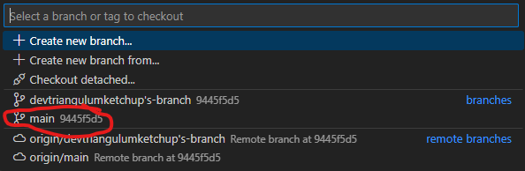
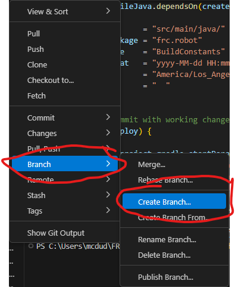
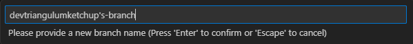
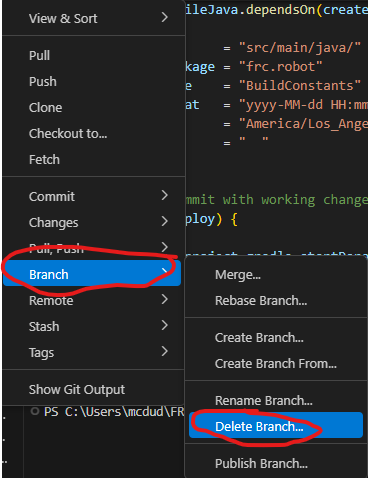
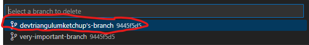
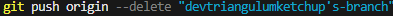
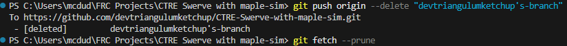

# Branching with Git VS Code Extension
In this tutorial, you will be shown how to use branches with the Git Source Control Extension on VSCode.

- [Creating Branches](#creating-a-branch)
- [Deleting Branches](#deleting-a-branch)
- [Deleting Remote Branches](#deleting-remote-branches)

## Creating a Branch:
1. Make sure that you are **on** the main branch before following this tutorial. If you are not sure that you are on the main branch, look at your bottom left corner in VSCode! It should say main, like in the example below!  
  
If you are **not** on the main branch, click on that button and switch to the **main** branch!

2. Click on the 3 dots as shown in the image below. Go to the branch menu and click on Create Branch!  

3. From there, you will have to provide a name for your branch! Try to name your branch after a feature/issue you are tackling! For example, I will call my branch **"devtraingulumketchup's-branch"**. Once you have a name, hit enter and you should be switched to your new branch automatically!

    

4. Once you have made your branch, publish it to Github! This is a **required** step that will allow you to save your progress on the cloud! When you make a branch, the button shown below will show. Make sure **to** click it!  
  

    Once you have done this, you should be able to see your branch on the Github repo!  
    If so, congratulations, you made your own workspace!  
    As always, if you ever need any help, ask your programming mentors! They will guide you in the right direction!

## Deleting a Branch:
1. Make sure that you are **on** the main branch before following this tutorial. If you are not sure that you are on the main branch, look at your bottom left corner in VSCode! It should say main, like in the example below!  
  
If you are **not** on the main branch, click on that button and switch to the **main** branch!

    Please **make sure** that you **do not** need your branch anymore. You do not need your branch once a pull request has been approved! Do **not** try to delete your branch with any changes, as Git will get very angry at you! 

2. Click on the 3 dots as shown in the image below. Go to the branch menu and click on Delete Branch!  

3. Make sure to delete **your own branch!** Please **do not** delete other people's branches without confirming with a mentor! In this tutorial, I will delete my own branch and not someone else's!

## Deleting Remote Branches:
Once that is done, you have deleted the branch on your computer! However, remember that Github saves things to the cloud. That means that we need to get rid of the branch on the cloud as well. Remote branches can only be removed with the terminal.

1. To start, create a new terminal in VSCode!

2. Once you have a terminal, type this command in there:  
**git push origin --delete "[branch-name]"**  
It should look something like this:
  
This command will delete your branch on the cloud! Be **careful** with the branch name! Make sure that you are removing **your own** branch! Git **is** case-sensitive and it will throw errors if a branch was not found.

3. Once that has been completed, type this command in there:  
**git fetch --prune**  
This command will fetch the latest version of the repository which will not have your remote branch! Your terminal output should look similar to this if you were successful!
 

Once you have finished, you have successfully deleted your branch!
As always, if you ever need any help, ask your programming mentors! They will guide you in the right direction!