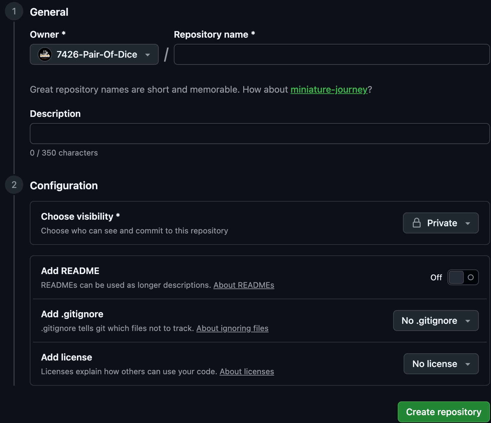
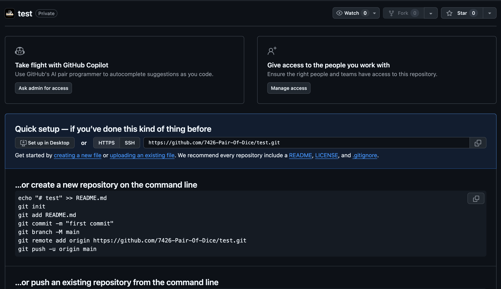
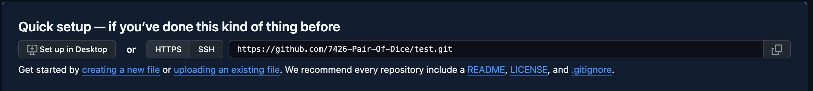
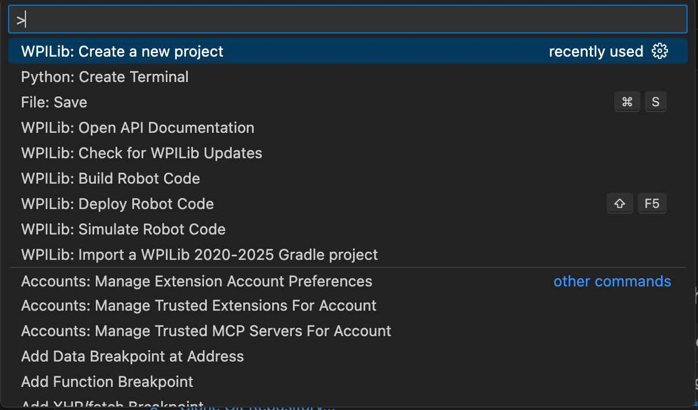
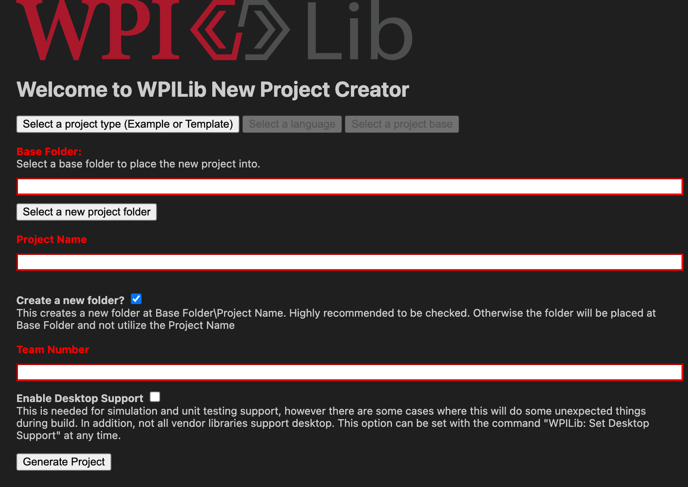
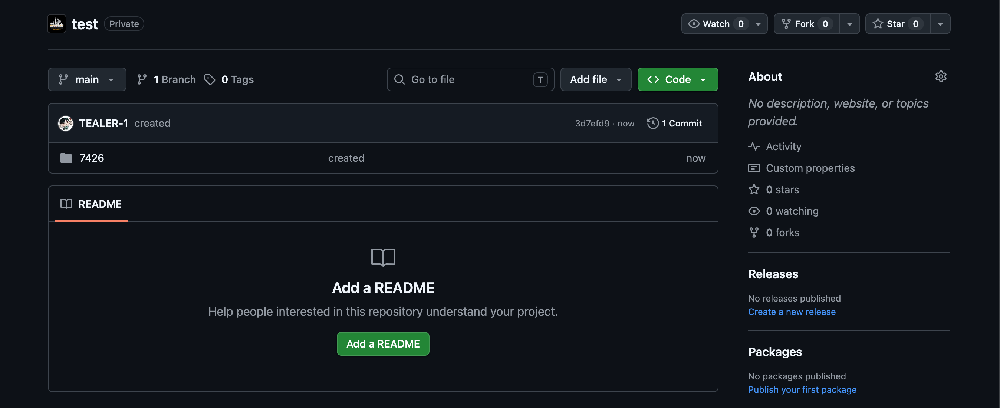

#Repositories:

Repositories store the actual code themselves. Repositories are especially useful as they store and note every change you make from the previous version, and allow you to revert them if needed.

## Making a new repository
To create a new repository head over to our Github. From there click on the reporsitory section. After navigating yourself there look for a green box that says "New Repository"

{: style="width:150px; height:50px;" }

After that give your repository a relevent name and a brief description if you'd like. For the most part visibility should be set to private, unless specified otherwise. After doing that click the green "Create Repository" button on the bottom right

{: style="width:350; height:300px;" }

If done successfully it should look show something lile the image below. 

{: style="width:500; height:300px;" }

## Opening up the new repository !

For this step we will be using the link from quick setup to then use the Clone Git Repository on vscode.

{: style="width:450; height:75px;" }
{: style="width:300; height:50px;" }

After that do Control+Shift+P (Command+Shift+P if on mac) to open up the command pallete.

{: style="width:400px; height:225px;" }

From there you should type in,"WPILib: Create a new project" after doing so it should look like this:

{: style="width:500; height:300px;" }

After doing that select project type as "Template", then "java" for the language, and lastly pick the project base as a command robot. After that the base folder should be the repository itself. With naming your project do your best to have it relevent to the type of project. After that generate it.

To see the code on Github commit and publish it, if done correctly it should look like this. 

{: style="width:500; height:200px;" }

