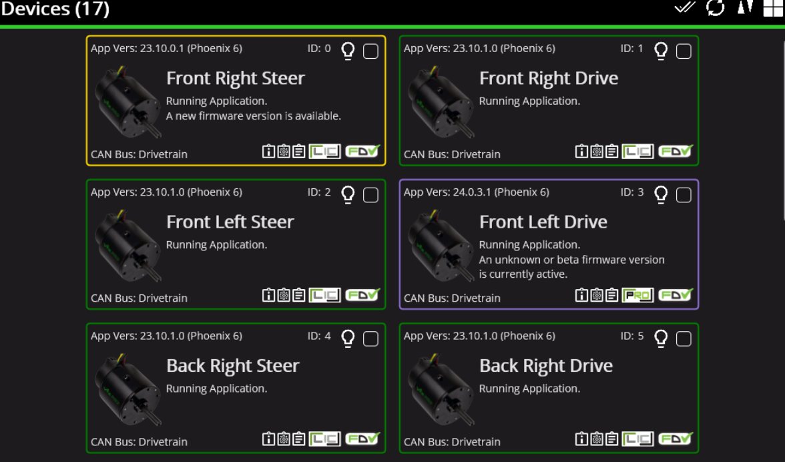
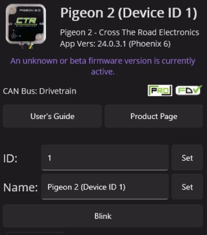
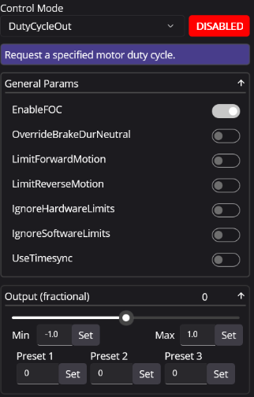

# Phoenix Tuner X
Phoenix Tuner X is the software we use to control CTRE related hardware.

To actually connect to it look at the bottom right and make you choose the correct method of connection.

{: style="width:175px; height:50px;" }

Theres 3 options, "localhost", "roboRIO USB", and "Driver Station". 

We often use the "Driver Station" as it allows us to wirelessly connect, via using the radio.

"roboRIO USB" is used if theres something wrong with the connection of the radio, and it requires connecting directly to the roboRIO with a USB

"localhost" isn't often used.

## Device List

{: style="width:500px; height:300px;" }

This shows all the devices that is **properly connected**, which means if you are missing some devices it'll most likely be a CAN issue.

The color bordering the devices are also vital aswell, as they tell you different things, green is latest version,
yellow is new firmware update, red is duplicated device ID, any other colors could be found on the CTRE documentation.

On the right side there will be a checkmark button, after clicking that it'll select all of the devices, from there you could press the up arrow to update all devices to the latest version.

## Configuration

This shows up when you press on an individual device.

{: style="width:300px; height:350px;" }

(It is reccommeneded you label what side the front and back are with a sharpie)

We use it for **properly** setting up the devices, such as front left drive, front left steer, ect. 
This is especially vital for using the swerve project generator. 

To properly set up the congurations of the devices follow these 3 steps-

1. Press "Blink" to allows you to figure out what device it is as it'll blink rapidly when pressed.
2. Properly name the device based on where it is on the robot using the front and back markings as a guide.
3. Check on the ID spreadsheet to determine what number the device should be.

## Control/Plot

On the control section on motors it allows you to run the motors to test for any issues with it, and in the signals section you are able to pick which parts it'll plot.

{: style="width:275px; height:400px;" }

To run the motor use the "DutyCycleOut" control mode and enable it. Once enabled you could use the move the bar or change the min or max to run it.

With plotting go to the "Signals" tab and drag what data you want to be plotted, such as position, voltage, ect.

If there are any questions always refer to the [documentation](https://v6.docs.ctr-electronics.com/en/stable/docs/tuner/index.html)

[Next](swerve-project.md)