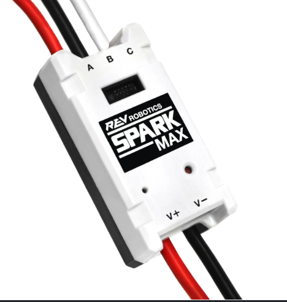

# Rev introduction:

Rev sells hardware and electrical components such as motors, motor controllers, ect. Rev has 2 types of motor controllers the SPARK MAX and the SPARK flex, the most common type is the SPARK MAX.

{: style="width:200px; height:150px;" }

[Next](rev-hardware-client.md)