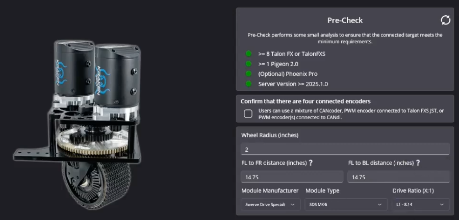
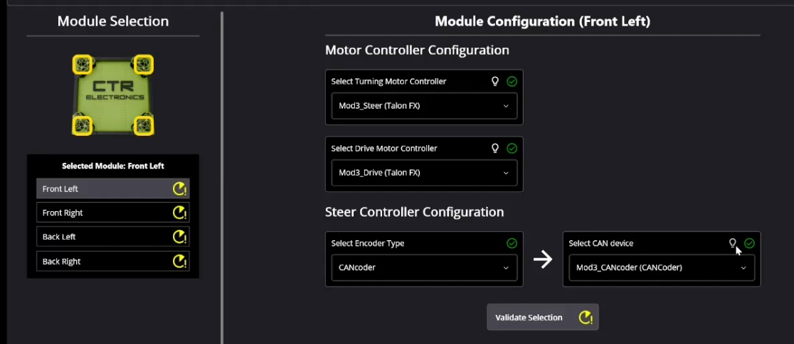
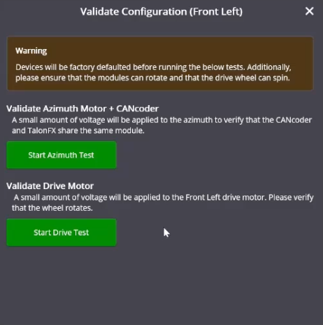
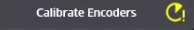
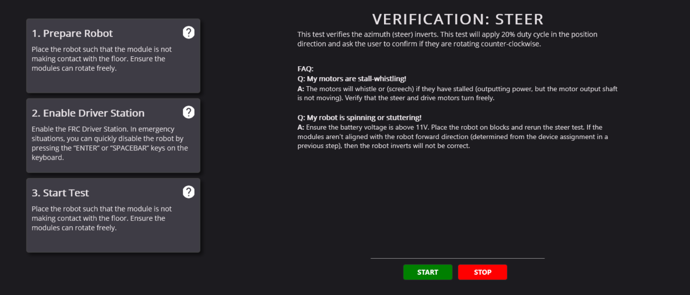
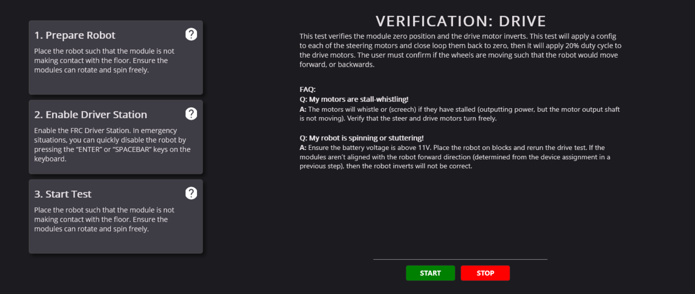
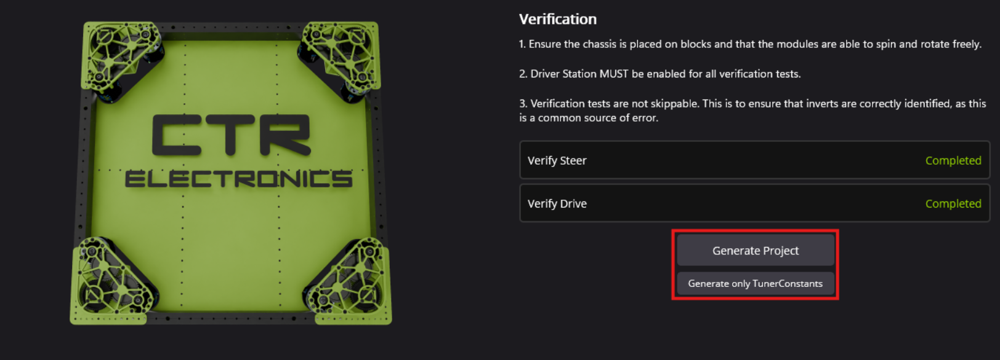

# Swerve Project
This is done using Pheonix Tuner X, which means this will only works with CTRE motors.

1. [Swerve req](#swerve-requirements)
2. [Configuring modules](#configuring-modules)
3. [Validating drivetrain](#validating-drivetrain)
4. [Generate](#generate)

If any errors occur always check the [documentation](https://v6.docs.ctr-electronics.com/en/stable/docs/tuner/tuner-swerve/index.html).

## Swerve Requirements
{: style="width:500px; height:250px;" }

The most important part to check for this part is the distance, wheel radius, module type, and drive ratio.

The distance could be obtained by using a measuring tape to measure from the **center to center** of the swerve modules.

The wheel radius is obtained fro, measuring the width/diameter of the wheel, and dividing it by 2.

To determine the module type go back and take a look at the device card of the motor.

For determining the drive ratio, check with the person who assembled it.

## Configuring Modules

In this step we use the already labled motors and encoders to set up each wheel, it acts like a final check to make sure everything is labled the way it should be.

{: style="width:500px; height:200;" }

There's 2 tests in this, the Azmuth and drive. For the Azmuth test it just spins the wheel, while for the drive test it drives the wheel. 

{: style="width:300px; height:300px;" }

On the left side there will me a "Calibrate Encoders" button.

{: style="width:200px; height:40px;" }

Before you calibrate the encoders make sure the side with the gear on the wheels are facing inside. After that get a straight edge, and push/lightly tap on the 2 motors on each side to straighten them, once that is done press the calibrate encoders button.

## Validating Drivetrain

For this section you will need to pay attention to all motors.

For the Azmuth section make sure all motors are spinning counter-clockwise **relative to the front** of the robot

{: style="width:400px; height: 200px;" }

For the drive section, make sure all motors are driving forward relative to the front **AND** that all motors are alligned properly (ex. the gear side isnt' facing outside.)

{: style="width:400px; height: 200px;" }

## Generate

Most of the time it'll be "Generate Project", but it could be "Generate Only Tuner Constants" if you're reconfiguring your encoders.

{: style="width:400px; height: 150px;" }
