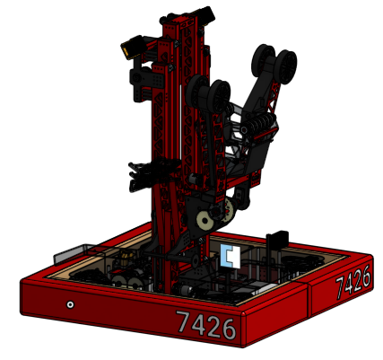
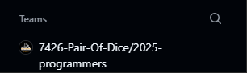

(Our 2025 REEFSCAPE Competition Robot: Deadpool)

# Getting Started:
Welcome to the programming team of 7426! To prepare for your journey, you will need to setup a few different tools that will be used throughout the season.

## WPILib (VS Code):
The primary tool that you will be using as a programmer on the team! WPILib allows us to write code that can interact withing the FRC Control System. If you want more information, you can follow this [link!](https://docs.wpilib.org/en/stable/docs/software/what-is-wpilib.html) 

To setup WPILib on your computer, click on this [link!](https://docs.wpilib.org/en/stable/docs/zero-to-robot/step-2/wpilib-setup.html)

If you ever need help, please make sure to let a programming mentor know!

## Git & Github
Another useful tool that you will be using is the Github platform! Github & Git allow programmers to work on codebases from anywhere at any time! Github is also particularly useful as it can be used as a place to share and backup code!

Please create a Github account as soon as possible! If you do not know how, follow this [link](https://docs.github.com/en/get-started/start-your-journey/creating-an-account-on-github) to get started!

Please download Git as well by following this [link!](https://git-scm.com/)

### Github Teams:

Once you have a Github account, make sure you let your Programming mentor know!
Make sure to provide them with your username and email, so that they can add you to a team, like shown below!

## Next Steps:
These are all the critical tools you will need for now as a beginning programmer! If you want to learn more, you can explore the website or read these [helpful resources!](resources.md)